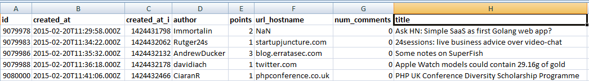
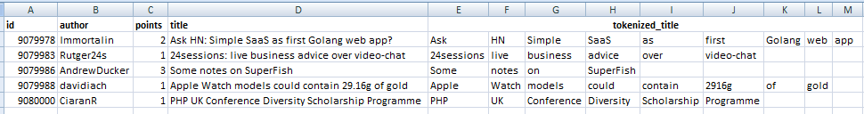

# Hacker-news---predict-upvotes-based-on-article-headline
This experiment aims to test out how important an article's title is in determining the number of upvotes it recieves.

We use Arnaud Drizard's dataset (full repo here: https://github.com/arnauddri/hn) on submissions made to Hacker News from 2006 to 2015 to build a bag of words model along with a simple linear regression to predict the number of upvotes based on the article's title.

The data looks as below:

For this experiment, we take a relatively small subset (20000 observations) of the entire dataset.

The flow in preparing the data as per the bag of words model is as below:
1) Cast the title column to lower case and remove all punctuations
2) tokenize the title column into a list of individual words. Once this is done the data will be as below:

3) Look at each tokenized title to compile a list of all unique words occuring in all titles and the number of times they appear in all titles

4) Ignore any words that appear just once, as they have no predictive power. Remove 'stopwords' - such as 'the','is','are' etc. These words tend to have the highest frequency and don't necessarily correlate with the number of upvotes. For this experiment we will use the pre-defined list of stop words in the python Natural Language toolkit.

5) Once stop words have been removed, analyze the frequency distribution of the rest of the words to identify the subset of words to use in the bag of words model. Each of these words will be a feature that our linear regression model will use for prediction.

6) Train linear regression model with 80% of the dataset and calculate RMSE using the 20% test set.

RMSE obtained using the above flow is about 45 upvotes.

Next steps:
1) Train model using the entire original dataset.
2) Use a more powerful ML algorithm, eg random forest.
3) word cloud visualization to understand the most commonly occuring words in titles with maximum upvotes.
